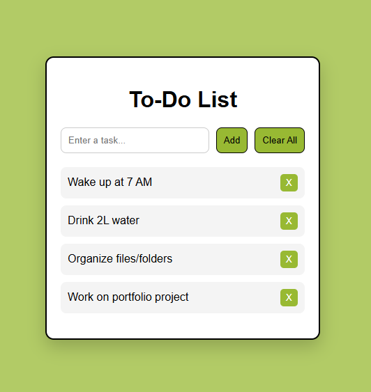

# To-do-list
A responsive and interactive To-Do List Web Application built using HTML, CSS, and JavaScript. This project allows users to efficiently manage daily tasks by adding, completing, and deleting items, with data stored locally in the browser.

### Technologies Used
* HTML, CSS, JavaScript (Local Storage for data persistence)

### Features
* Add, delete, and mark tasks as complete
* Prevents empty task entries
* Simple, responsive, and user-friendly interface

###  Preview

### Future Scope
Can be enhanced with cloud storage for cross-device sync, user authentication, reminders/notifications, and priority-based task management.

### Conclusion
This project demonstrates an efficient and user-friendly way to manage daily tasks, highlighting core web development skills and practical implementation of local data storage.
